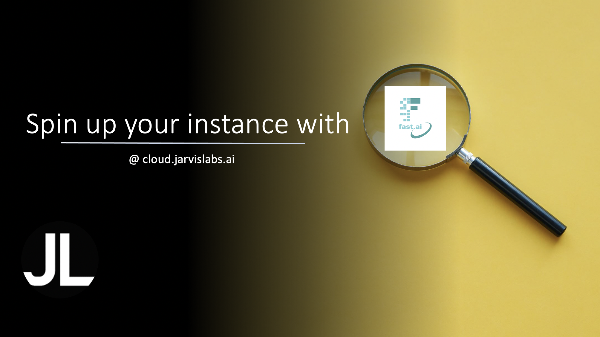
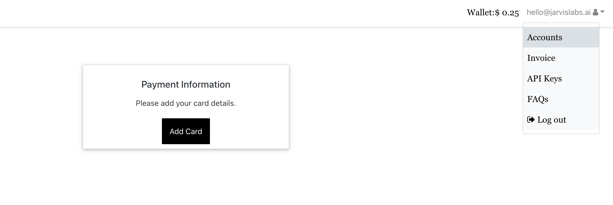
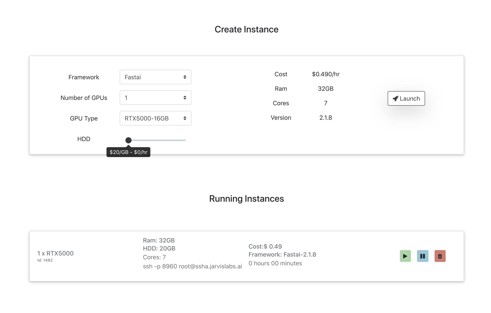

# Jarvis Cloud


This is a quick guide to start Practical Deep Learning for Coders using [Jarvis Cloud](https://cloud.jarvislabs.ai/?token=fastaiv4). With Jarvis Cloud you get a GPU powered Jupyter notebook pre-configured with all the necessary software in less than 30 seconds.

## Quick Start

1. Create an account at [cloud.jarvislabs.ai](https://cloud.jarvislabs.ai/register/?token=fastaiv4)
1. Add payment information in [Account section](https://cloud.jarvislabs.ai/account)
1. Recharge wallet to add funds using [recharge wallet](https://cloud.jarvislabs.ai/account)
1. Select machine type [here](https://cloud.jarvislabs.ai/) and click `Launch`
1. Start, Pause, or Delete with the buttons 

> Note: Paused instances are only charged for storage.

## Pricing

### Pricing for Running instance

[Jarvis Cloud](https://cloud.jarvislabs.ai/?token=fastaiv4) offers instances with different kinds of GPUs. Jarvis Cloud recommends using RTX 5000 for this course. A single instance created with 1 RTX 5000 costs $0.49/hour and comes with 7cores, 32GB RAM and a default 20GB storage space. Any additional storage will be charged at $0.0005/GB an hour.  

**All fastai students get a discount of 20% on RTX 5000 GPU's.**  So an instance created with 1 RTX 5000 card and 20GB of storage will cost you $0.392/hour.

### Pricing for Paused instances
To continue your work at a later point in time, Jarvis Cloud offers a pause feature. During the paused duration you will be charged only for the storage allocated to you. 

For Example, an instance with 30GB storage while paused is charged at 0.015$/hour (Each GB costs $0.0005). Jarvis Cloud continues to charge for the storage as long as the instance is paused or till the account has enough funds. 

All the data gets deleted only when the account does not have enough funds or you choose to delete it.  

## Step 1: Create an account
Sign up here [cloud.jarvislabs.ai](https://cloud.jarvislabs.ai/?token=fastaiv4) to get the 20% discount on RTX 5000. 

## Step 2: Add Credits
To avoid any unnecessary billing Jarvis Cloud follows a prepaid system. You buy credits using a credit card. For all the activities like create, pause, and resume Jarvis Cloud deducts money from the credits added to the Jarvis Cloud wallet. 

### Add a Credit card 
Jarvis Cloud uses Stripe for managing all the credit card transactions. All the data shared to Jarvis Cloud related to your card is passed directly to Stripe. Jarvis Cloud does not store any information related to your credit card. You can add card details from the accounts section.



### Recharge the wallet
Once the card is added successfully, you can recharge for a predefined amount of $10, $20, $50 or $100. If the recharge is successful, then Jarvis Cloud adds the same amount as credits in the wallet.


## Step 3: Launch Instance to learn Fast.ai

Choose fast.ai from the frameworks, number of GPU's(Recommended 1) and storage you need. 


Once you have chosen the configuration press the launch button. Your instance should be created in less than 30 seconds. You should be able to see a running instance like this. 


Commonly used tools like git, wget and several other python libraries along with fast.ai course materials come preloaded.

**Launch only when you are ready to use, as the instances are charged for an hour**. 

There are 4 important things that you can quickly do from the running instances. You can access jupyter lab, pause the instance after using, remove it completely when done and also connect to the instance through command line(Optional). 

### Connect to Jupyter Lab & start learning fast.ai
Clicking the green color play button on the running instance opens a Jupyter Lab. If you like to work with Jupyter notebook, then change the word **lab** to **tree** in the url. 


You can see the **fastbook** folder already downloaded for you. Open a terminal and navigate to the **fastbook** folder and do a git pull to update the course.

```
cd fastbook/
git pull
```

###  Pause your instance
After running few experiments, if you want to pause the instance for a later use then press the blue color pause button. You will be charged only for the storage during the paused duration.

All the paused instances are listed below the running instances.


This feature is useful when you plan to return to use the instance in few hours or few days. If you plan not to use the instance further then press the red trash button to stop Jarvis Cloud from charging for the storage.

### Resuming an instance
You can hit the play button on the paused instance to resume your work. A new instance is created with all your previous data. 

### Destroying/Stopping the instance
If you have completed your work and no longer require the instance, then press the red color trash button, which will delete/destroy the entire instance. Your billing will be stopped. This is not a recoverable event, so ensure you have backed up any data that is required. 

**Note: Ensure you destroy the instance to avoid any unnecessary billings**

### Connecting via SSH to the instance
You can also see a ssh command in the running instances section, which lets you ssh to the instance from a command line tool. If you like using VS code for coding, then you can use this to connect the VS Code to the remote instance. For simple access to the command line, you can use the terminal from jupyter lab. 

**To see the ssh command you need to update your public ssh key from the API keys section**

## Step 4: Add SSH keys
If you have created your ssh_keys earlier you can access it by using the below command in a **local**  terminal / PowerShell and update it in the API keys section.
```
cat ~/.ssh/id_rsa.pub
```


If you do not have a ssh key then quickly create one. 

### Create your local SSH key pair

Run the following command in a  **local**  terminal / PowerShell to generate an SSH key pair:
```
ssh-keygen -t rsa -b 4096
```

## Need help

Drop an email to hello@jarvislabs.ai for any assistance or feature requests related to [Jarvis Cloud](https://cloud.jarvislabs.ai/?token=fastaiv4). 
